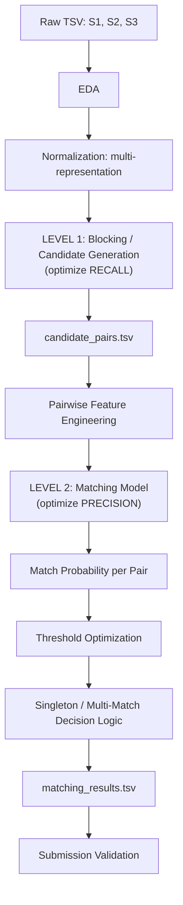
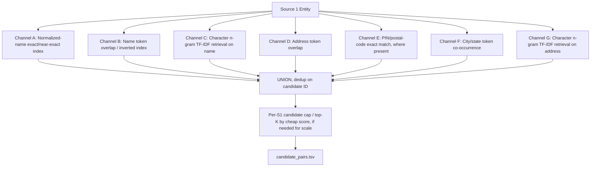
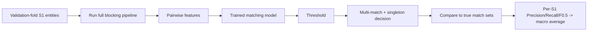
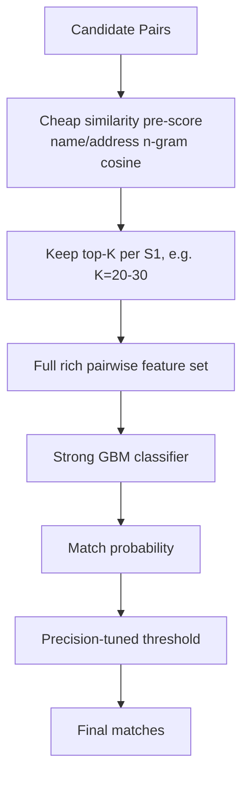
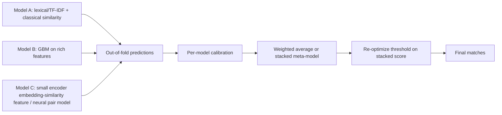
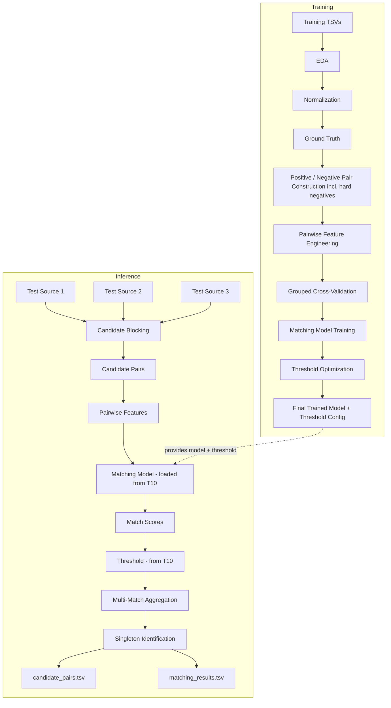

# Business Entity Resolution Challenge — Full System Architecture

> Source of truth: the official problem statement (F₀.₅, macro-averaged per-S1-entity;
> TSV I/O; S1 = deduplicated reference; S2/S3 = noisy sources; France appears only in test;
> MIT/Apache-2.0, ≤8B parameter model constraint; no external lookups).
> This document is evidence-driven — no technique below is guaranteed to win; every
> recommendation is something you validate on your own holdout split.

---

## 0. Governing Principle: A Two-Level System

Everything below implements exactly two decoupled subsystems, because they optimize
**different, sometimes opposing objectives**:

| Level | Goal | Optimizes for | Output |
|---|---|---|---|
| **Level 1 — Blocking** | Never let a true match get discarded | **Recall** (near 100%) | `candidate_pairs.tsv` |
| **Level 2 — Matching** | Never call a wrong pair a match | **Precision** (F₀.₅ weights it 2×) | `matching_results.tsv` |

Level 2 can only be as good as Level 1 allows — a pair Level 1 drops can *never* be
recovered. Level 1 can be loose; Level 2 must be strict. Keep them architecturally
separate (separate modules, separate metrics, separate owners) so you can debug and
improve each independently.



---

## 1. Data Ingestion Architecture

**Loading.** Always `pd.read_csv(path, sep="\t", dtype=str, keep_default_na=False)`.
Force `dtype=str` — entity IDs, PIN codes, and house numbers must never be silently
cast to int/float. `keep_default_na=False` prevents pandas from turning literal empty
strings into `NaN` and mangling values like a business named "NA Traders".

**Schema validation** (run on every file, train and test):
- Exactly the expected columns, in any order, no extras silently dropped.
- `entity_id` non-null, matches regex `^(S1|S2|S3)-\d+$` for the file it's in — i.e. a
  file named `*_source2.tsv` must only contain `S2-` prefixed IDs. A prefix mismatch is
  a data-integrity finding to log, not silently fix.
- No duplicate `entity_id` values within a file.
- `business_name` non-empty for effectively all rows (flag the exceptions).
- `country` non-null; **do not** validate against a fixed enum. Log the distinct value
  set for visibility, but never filter or reject unfamiliar values — this is exactly
  where a hardcoded assumption would silently break on France at test time.

**Ground truth structural checks:**
- Every `source1_entity_id` in the ground truth exists in `train_source1.tsv`.
- Every ID inside `matched_entity_ids` exists in `train_source2.tsv` or `train_source3.tsv`
  and carries an S2-/S3- prefix (a self-referencing S1- ID in the match list would be a
  labeling bug worth flagging, not silently accepting).
- No duplicate IDs within one entity's match list.

**Duplicate / near-duplicate detection within a source file itself** (distinct from
cross-source matching): exact-duplicate `(business_name, business_address, country)`
rows can happen from source-side scraping issues — log the count, don't auto-drop, since
"same name+address twice" might legitimately be two branches.

**Missing-value analysis**: per-column null/empty rate, per source, per country. This
directly informs normalization (§3) and blocking (§4) — e.g. if 30% of India addresses
have no PIN code, a PIN-code-based blocker alone would miss a third of true matches.

**Summary statistics to compute and log** (feeds §2): row counts per file; unique
country values per file and their frequencies; name length/token-count distributions;
address length/token-count distributions; S1-to-ground-truth coverage rate (fraction
of S1 entities with ≥1 match vs. singletons).

Deliverable of this stage: an `ingestion_report.md`/notebook artifact with all counts
above, checked into `notebooks/01_eda.ipynb` — this becomes the audit trail referenced
in your methodology document.

---

## 2. Data Profiling & EDA

### Business Name
- Length (chars) and token-count histograms, per source, per country.
- Punctuation inventory: `&` vs `and`, `.`, `,`, `-`, parentheses (often wrapping DBA
  names, e.g. `Sharma Traders (Sharma Enterprises)`).
- Legal-suffix inventory: mine the tail token(s) of every name (`Ltd`, `Limited`, `Pvt`,
  `Private`, `LLC`, `Inc`, `Corp`, `Corporation`, `Co`, `& Sons`, `Pvt Ltd`, `Pvt. Ltd.`) —
  build a frequency table; this becomes your suffix-normalization dictionary in §3, and
  you should **derive it from the data**, not assume a canonical list.
- Case pattern: ALL CAPS vs Title Case vs mixed — inconsistent casing across sources is
  a near-certainty and must not leak into similarity scores (hence lowercasing in §3).
- Numeric tokens in names (e.g. store numbers, "Store #42", "Shop No 7") — these can be
  strong disambiguators between chain-branch entities and must be preserved in at least
  one representation.
- Transliteration variants — spot check India records for Devanagari-to-Latin spelling
  variance (`Shree`/`Sri`/`Shri`) — build a small equivalence-class list from observed
  training pairs rather than an external transliteration dictionary (external
  augmentation is prohibited; deriving equivalences from your own train pairs is fine).
- Token frequency: compute global and per-country token DF. High-DF tokens (`Ltd`,
  `Store`, `The`, `India`, `Inc`) carry little discriminative signal and should be
  down-weighted (TF-IDF naturally does this) or optionally stripped in one of your
  normalized representations, never in all of them.
- Exact-duplicate name collisions across different addresses — signals that name alone
  is an unreliable blocking key and address must carry real weight.

### Business Address
- Length/token histograms per country — US and India addresses have structurally
  different token grammars, France in test will differ again.
- Digit density — presence of house/building numbers, PIN/ZIP codes.
- PIN/ZIP presence rate per country; validate against country-appropriate format
  (5-digit for US-style, 6-digit for India-style) **as a descriptive check only**, never
  as a hard filter, since France will use a different format entirely (5-digit, letters
  in some EU formats).
- City/state/region token extraction — use frequency mining (tokens that recur across
  many different businesses within a source are likely place names, not business-
  specific tokens) rather than a hardcoded gazetteer, keeping you compliant with the
  no-external-data rule while still generalizing to France.
- Landmark phrases: mine n-grams like `near `, `opp `, `behind `, `next to ` — these
  need a distinct handling path (they help humans but often hurt string similarity
  because they're absent on the matching record).
- Missing components: rate of addresses with no digits at all (no house number/PIN),
  by country — directly caps what address-based blocking can achieve for that subset.
- Abbreviation inventory (`Rd`/`Road`, `St`/`Street`, `Ave`/`Avenue`, `Apt`/`Apartment`),
  built empirically the same way as legal suffixes.

### Country
- Frequency table, train vs. test (if test S1 sample is partially visible via public
  leaderboard behavior, otherwise reason from the problem statement: train = {US, India},
  test = {US, India, France}).
- Missingness rate.
- **Explicit design check**: confirm no part of the codebase does `if country in
  ["US","India"]` or one-hot encodes country with a fixed vocabulary fit only on train.
  Country must be used as (a) a hard/soft compatibility feature between a pair (same
  string vs. different) and (b) optionally as a grouping key for blocking — never as a
  fixed categorical embedding matrix sized to two classes.

### Ground Truth
- Match-count-per-S1 histogram → singleton rate (this is your **baseline reference
  point**: predicting all-empty gets you exactly this fraction × 1.0 on those rows).
- One-to-one vs. one-to-many rates, and split by "matches only in S2", "matches only in
  S3", "matches in both".
- Country-conditioned singleton rate — some countries may have systematically sparser
  coverage in S2/S3.
- Distribution of *why* a pair matches — sample 30–50 positive pairs by hand and
  categorize the dominant matching signal (exact name+address / abbreviation-only
  difference / address-only match with different name formatting / name-only match
  with a landmark-based address) — this sample directly drives which similarity
  features in §6 you prioritize.

**EDA recommendations to carry forward** (write these explicitly in your findings):
1. Country is high-cardinality-safe only if treated as a string-equality feature, never
   an embedding index.
2. Address alone will under-block for the missing-PIN subset → need a name-based
   blocking channel as a safety net, not just address-based blocking.
3. Legal-suffix and abbreviation dictionaries should be **mined empirically** per
   source/country rather than hand-authored, so they transfer to French naming/address
   conventions reasonably (French legal suffixes like `SARL`, `SAS` will simply appear
   as just another suffix token once you run the same frequency-mining approach at
   inference time — build normalization to be **data-driven and country-agnostic**, not
   a lookup table of `{Ltd: Limited}` pairs alone).

---

## 3. Entity Normalization — Multiple Representations, Not One

**Principle:** never collapse to a single normalized string. Different similarity
features need different levels of aggression. Produce, per record, per field:

| Representation | Transformations applied | Used for |
|---|---|---|
| `raw` | none | display / audit / exact-ID checks |
| `normalized` | Unicode NFKC → lowercase → whitespace collapse → punctuation standardized (`&`→`and`, remove `.`/`,`) → legal-suffix map applied → common-abbreviation map applied | primary string-similarity features (Levenshtein, Jaro-Winkler) |
| `tokenized` | `normalized` split into token list, stopword-light (keep legal-suffix tokens as *separate* signal, don't delete them — deletion loses "Pvt Ltd vs LLC" signal) | Jaccard, token-set/token-sort, containment |
| `char_ngrams` | `normalized`, no spaces removed, sliding 3–4 char n-grams | TF-IDF cosine, n-gram Jaccard — robust to typos and word-order swaps |
| `digits_only` | all digit sequences extracted, preserving order (house numbers, PIN, store numbers) | numeric/PIN/house-number compatibility features |
| `sorted_tokens` | `tokenized` alphabetically re-ordered and rejoined | catches pure word-order transpositions cheaply |

Apply the same schema to `business_address`, plus an address-specific extra:
- `address_components` — a best-effort split into {house/street-number, street-name
  tokens, city-candidate token(s), state-candidate token(s), postal-code, landmark
  phrase} using **regex + frequency-mined gazetteers from your own training data**
  (e.g., tokens that appear as the last address token across many records within a
  country cluster and correlate with low business-specificity are city/state
  candidates). Keep this soft (probabilistic tags), not a hard parser — noisy real-world
  addresses will break a strict grammar.

`country`: `normalized` (lowercase, trimmed) is sufficient — do not stem/lemmatize
country names or map to ISO codes via an external table (build the observed→canonical
map, if any, purely from co-occurring spellings inside the provided data, e.g. `usa` /
`u.s.a.` / `united states` appearing for the same records).

**What NOT to destroy:**
- Don't strip legal suffixes in the representation used for exact/near-exact matching —
  `ABC Pvt Ltd` vs `ABC Trading Pvt Ltd` should stay distinguishable.
- Don't lose digit tokens in any representation — store/unit numbers are often the only
  disambiguator between chain locations.
- Don't over-normalize address landmarks away entirely — keep a `landmark_phrase`
  extracted field for optional use, but exclude it from the primary similarity string
  since it introduces asymmetric noise (present on one side, absent on the other).

Normalization dictionaries (suffixes, abbreviations) should be **versioned artifacts**
(`configs/normalization/suffixes.json`, `abbreviations.json`) built from §2's frequency
mining and checked into the repo — this makes the transform auditable and reproducible,
and keeps them easy to extend if France introduces new suffix patterns you spot during
error analysis.

---

## 4. Candidate Generation / Blocking (Level 1 — maximize recall)

Multi-channel blocking, unioned, because each channel has a different failure mode:



**Channel design:**

- **A — Normalized-name exact/near-exact.** Hash `normalized` name (or its sorted-token
  form) into a dict → O(1) lookup. Catches clean duplicates and pure suffix/punctuation
  differences. *Misses:* typos, word-order-plus-abbreviation combos, transliteration.

- **B — Name token inverted index.** Build `token → [entity_ids]` from `tokenized`
  name across S2/S3; for an S1 entity, union candidates from its own name tokens
  (excluding globally very-high-DF tokens like `Ltd`/`Store` to control candidate
  explosion). *Misses:* heavy typos that change token forms, transliteration spelling.

- **C — Character n-gram retrieval (name).** Build a TF-IDF vectorizer over char 3–4
  grams (fit on train+test *names* together, unsupervised, no labels needed — this is
  not external data, it's the provided corpus itself), retrieve top-K nearest S2/S3
  vectors per S1 via cosine similarity (sparse matrix + `sklearn`/`scipy` top-k, or an
  ANN index like `hnswlib`/`faiss` if S2∪S3 is large enough that brute-force cosine is
  too slow). This is your typo/transliteration safety net.

- **D — Address token overlap.** Same inverted-index approach as B but on address
  tokens (post street-suffix normalization). Catches cases where the name differs a lot
  (DBA/trade name) but the address is essentially the same.

- **E — Postal/PIN exact match.** Cheapest, highest-precision blocking signal when
  present on both sides — but only covers the subset of records with a populated PIN
  (per §2 missingness stats), so it's a *supplementary* channel, never load-bearing
  alone.

- **F — City/state co-occurrence.** From the frequency-mined city/state candidate
  tokens (§3), block on shared city+state token pair. Coarser than PIN but has much
  higher coverage since city names survive noisy addresses more often than PIN codes.

- **G — Character n-gram retrieval (address).** Same TF-IDF/ANN approach as C, applied
  to `char_ngrams` address representation. Catches partial-address / component-reordered
  cases that token overlap misses.

**Country as a blocking pre-filter, cautiously.** You may restrict candidate search to
same-`country_normalized` records as a first-pass efficiency filter *if* your EDA (§2,
§5) confirms cross-country true matches are effectively zero in ground truth — verify
this empirically before hardcoding it, and even then keep it as a configurable flag,
not baked into the retrieval index, because it's exactly the kind of assumption that
could silently misbehave if France-labeled records have any inconsistent country
tagging.

**Per-channel recall bookkeeping is mandatory** — see §5.

**Candidate cap.** If any single S1 entity accumulates an unreasonably large candidate
set (e.g., a very generic name like "City Store"), cap at a large top-K (e.g. 200) using
the cheapest available score (e.g. char n-gram cosine) purely to bound Level-2 compute —
document this cap explicitly since it is a recall-limiting decision.

`candidate_pairs.tsv` must be **exactly** what Level 2 scores — not an earlier, wider
pre-filter you later cut further inside the model code. If you add any filtering after
blocking (e.g., a cheap pre-score cutoff before the expensive classifier), that filtered
set *is* what goes into this file.

---

## 5. Blocking Recall Analysis

Define, on your **held-out validation split** (§8) where ground truth is known:

```
Blocking Recall = |true positive pairs present in candidate set| / |all true positive pairs|
Reduction Ratio  = 1 − (|candidate pairs| / |S1| × (|S2| + |S3|))
```

Report, per channel and cumulatively:

| Channel | Standalone recall | Cumulative recall (∪ so far) | Candidates added | Notes |
|---|---|---|---|---|
| A: exact name | … | … | … | fails on typos |
| A∪B | … | … | … | |
| A∪B∪C | … | … | … | n-gram catches typos |
| A∪B∪C∪D | … | … | … | address safety net |
| A∪B∪C∪D∪E | … | … | … | PIN, sparse coverage |
| A∪B∪C∪D∪E∪F | … | … | … | |
| **Full union (final)** | **target: ≥ 0.97–0.99** | | | this is your recall ceiling |

Also report distribution stats: mean/median/max candidates per S1 entity, and the rate
of S1 entities that get **zero** candidates (these become forced singletons regardless
of what Level 2 does — investigate every one by hand if the count is small).

**Failure audit:** for every true pair *not* recovered by the full union, manually
categorize the miss (e.g., "name totally different + no shared address tokens" —
possibly a labeling artifact worth flagging, or a genuinely hard DBA case). This audit
is what motivates adding a new channel rather than guessing.

Do not tune blocking for speed at the expense of this recall ceiling — a faster blocker
that drops 2% more true pairs than a slower one caps your maximum achievable F₀.₅ by
roughly that much, which the precision-heavy metric cannot make up for later.

---

## 6. Pairwise Feature Engineering (Level 2 input)

Compute for every `(S1 record, candidate record)` pair. Group by discriminative power
based on §2's manual-sample findings — build all of these, then let feature importance
from the classical ML model (§9) confirm which matter, rather than guessing upfront.

**Name features**
- Exact match: `raw`, `normalized`, `sorted_tokens` (3 binary/near-binary flags)
- Levenshtein similarity (normalized to [0,1]) and raw edit distance
- Jaro-Winkler similarity (good for prefix-heavy near-duplicates)
- Token Jaccard, token overlap coefficient, containment (is one token set ⊆ other)
- Token-sort-ratio and token-set-ratio (RapidFuzz-style — handle word-order and subset
  cases cheaply)
- Character n-gram Jaccard / TF-IDF cosine (typo/transliteration robust)
- Common-token count and rare-token overlap count (weight distinctive tokens more; a
  shared rare surname-like token is stronger evidence than a shared "Store")
- Length difference (char and token count)
- Digit-token overlap (store/unit numbers)
- Legal-suffix compatibility flag (same suffix class vs. different vs. one-missing)

**Address features**
- Exact match: `normalized`, `sorted_tokens`
- Token Jaccard / overlap
- Character n-gram TF-IDF cosine
- Edit similarity (Levenshtein-normalized)
- PIN/postal exact-match flag, and PIN-missing-on-one/both-sides flags (missingness
  itself is informative — treat "unknown" as its own state, not silently as 0
  similarity)
- City-token match, state-token match (from the §3 soft component extraction)
- House/building-number compatibility (digit-token exact/partial match)
- Numeric-token overlap (broader than PIN/house number)
- Address length difference
- Landmark-token overlap (low weight; presence/absence asymmetry expected)

**Country features**
- Exact match after normalization (binary)
- Both-missing / one-missing flags
- **Unseen-country flag**: `1` if this country string was never observed in train — this
  lets the model (and your later error analysis) explicitly track France-like behavior
  rather than being surprised by it. Do **not** feed a fixed-vocabulary one-hot of
  country; feed only these compatibility/missingness/unseen flags, which are structurally
  identical whether the value is "US", "India", or "France".

**Cross-field / interaction features**
- `name_sim × address_sim` (product) — rewards agreement on both
- Disagreement indicator: `name_sim high AND address_sim low` and the reverse — flags
  candidate pairs that need closer look (chain-branch ambiguity: same name, different
  branch address vs. DBA: different name, same address)
- Max/mean/min across the name-similarity feature subset and address-similarity subset
  (compresses the feature group into a robust summary the model can also use directly)
- Blocking provenance: which channel(s) in §4 surfaced this candidate (one-hot over
  {A..G}) — a pair found *only* by the weak char-n-gram channel is a priori less likely
  to be a true match than one found by three channels simultaneously; this is a
  legitimate, strongly discriminative feature.

**Likely most discriminative** (validate, don't assume): character n-gram cosine on
name, token Jaccard on address, PIN exact-match (when present), and the cross-field
disagreement indicators — these directly encode the noise patterns the problem
statement calls out (typos/transliteration → n-grams; reordering → Jaccard/sorted
tokens; partial addresses → PIN/city fallbacks).

---

## 7. Training Pair Construction

**Positives.** Explode `train_ground_truth.tsv`: for each `source1_entity_id`, split
`matched_entity_ids` on `,`, emit one `(s1_id, matched_id, label=1)` row per match.
Rows with an empty match list contribute **zero positive pairs** but are still
important — they define your singleton population (used in §8/§12, not as pair-level
training rows).

**Negatives — must come from the blocking output, not randomly from the whole corpus.**
The model will be scored on candidates *your own blocker* produces, so its negative
distribution during training must match that at inference. Concretely:

1. Run your full Level-1 blocking pipeline on the **training** S1/S2/S3 files.
2. For each S1 entity, every candidate in its blocked set that is **not** in its
   ground-truth match list is a negative pair.
3. This alone typically yields a large negative:positive imbalance dominated by
   genuinely easy negatives (blocked only because of a coincidental shared common
   token) — useful for teaching the model to reject obviously-wrong pairs cheaply, but
   insufficient alone.

**Hard negatives — the most important part of this section.** These are near-miss pairs
that would fool a weak similarity threshold: same country + high name similarity but a
different business (chain competitors, e.g. two unrelated "City Bakery" entities), or
high address similarity but a clearly different business name (two businesses at the
same shopping complex/mall). Mine them by:
- Taking all blocked-but-negative pairs and ranking by a cheap composite similarity
  score (e.g., name char-n-gram cosine + address token Jaccard); the top slice of this
  ranked list *among negatives* is your hard-negative set.
- Explicitly including same-block, same-country, similar-name-different-address and
  similar-address-different-name cases as separate hard-negative sub-categories so the
  model sees each failure mode, not just one dominant type.

**Why hard negatives matter here specifically:** F₀.₅ punishes false positives 2× more
than it rewards recall. A model trained only on easy negatives will look great on
validation pairwise accuracy while still making exactly the confident-but-wrong calls
(chain-branch confusion, shopping-complex confusion) that tank entity-level precision
and therefore F₀.₅. Weight or oversample hard negatives during training (e.g.,
class-balanced batches with a fixed hard-negative ratio, or `scale_pos_weight`/sample
weights in gradient boosting).

**Sampling ratio guidance:** start around 1:3 to 1:10 positive:negative after including
hard negatives (not the raw, much larger, blocked-negative ratio) — tune empirically
against validation F₀.₅, not pairwise accuracy.

---

## 8. Train / Validation Split

**Split at the Source 1 entity level, not the pair level.** If pairs from the same S1
entity appear in both train and validation, the model can effectively memorize
entity-specific quirks and validation will overstate real performance. Steps:

1. Take the list of unique `source1_entity_id` values in `train_source1.tsv`.
2. Stratify the split by: singleton vs. has-matches (preserve the true singleton rate in
   both halves), and roughly by country (preserve country mix, especially since India
   and US may have different match-rate profiles).
3. Assign ~80–85% of S1 entities to train, ~15–20% to validation (K-fold grouped CV is
   preferable if time allows, using `GroupKFold` keyed on `source1_entity_id`).
4. Route the **matched** S2/S3 records for a validation-fold S1 entity into the
   validation candidate pool; the remaining S2/S3 records stay available as the general
   corpus for blocking (an S3 record could still legitimately be a same-fold false-lead
   candidate — that's realistic and fine, just don't let a validation-fold S1's
   ground-truth match get *reused* as a positive-training example in the train fold).

**Validation must simulate the real task end-to-end**, not just score pairwise
predictions in isolation:



Track **both** pairwise metrics (precision/recall/AUC on the classifier itself — useful
for debugging) **and** entity-level F₀.₅ (the metric that actually matters) — never let
pairwise AUC alone drive decisions; a model can have great pairwise AUC and still hurt
entity-level F₀.₅ if its errors cluster on high-degree S1 entities.

---

## 9. Model Architecture — Comparison

| Approach | Fit for this problem | Notes |
|---|---|---|
| **A. Rule-based baseline** (e.g., name_sim > t1 AND addr_sim > t2) | Fast, fully interpretable, good sanity baseline and blocking-recall sanity check | Ceiling is limited; won't handle interaction effects (strong-name/weak-address vs. weak-name/strong-address trade-offs). Build this first — it's your floor to beat. |
| **B/C. Classical ML on similarity features (logistic regression → gradient boosting)** | **Primary recommended approach.** Tabular similarity features are exactly what GBMs (LightGBM/XGBoost/CatBoost) excel at; handles feature interactions, is fast to train/iterate, trivially interpretable via feature importance/SHAP, and has zero license/parameter-count concerns. | Start with logistic regression as an interpretable baseline, move to GBM for the real model. This is where most of your iteration time should go. |
| **D. Neural pair classifier** (small MLP/Siamese net over engineered features or character embeddings) | Reasonable if GBM plateaus and you have enough hard-labeled pairs; can learn subtler interactions | Higher engineering cost, needs more careful regularization on a moderate-sized labeled set; only pursue if GBM ceiling is clearly reached and validated. |
| **E. Transformer-based pair model** (small encoder, e.g. a sentence-embedding model fine-tuned for pair classification, or a compact cross-encoder) | Can help specifically with the **character n-gram retrieval / semantic similarity** side of blocking and as one signal into the matcher — strongest where typos/transliteration/word-order make lexical features weak | Must be MIT/Apache-2.0 licensed and ≤8B params (trivially satisfied by small encoders in the 20M–500M range — you do **not** need anywhere close to 8B; bigger is not automatically better here and adds cost/latency for no clear F₀.₅ gain on tabular-style noise). Use it to *generate features* (embedding cosine similarity) feeding into the GBM, or as one ensemble member — not as a free-text generator, since this is a classification/scoring task, not generation. |
| **F. Hybrid** (GBM on rich engineered features, optionally + one embedding-similarity feature from a small encoder) | **Recommended end-state** if E demonstrably helps on validation | Combines interpretability/speed of B/C with the noise-robustness of E where lexical features alone fall short (heavy transliteration, aggressive reordering). |

**Recommendation:** Start with A (baseline/sanity check) → B/C (LightGBM/XGBoost/
CatBoost as your workhorse — this alone is very likely to be competitive) → optionally
add one small sentence-embedding model's cosine-similarity as an extra feature into the
GBM, or as a separate blocking channel (§4-C/G) → only formalize as an ensemble (§16) if
validation shows a genuine, reproducible F₀.₅ lift.

If a transformer feature is used: input = `(normalized name [SEP] normalized address)`
per record, encode both S1 and candidate record independently (bi-encoder, cheap to
scale for blocking) or jointly (cross-encoder, more accurate but only feasible on the
already-blocked candidate set, not full cross product); training objective =
contrastive/pairwise (positive pairs pulled together, hard negatives pushed apart) using
exactly the pairs from §7; parameter count for any off-the-shelf small encoder (e.g. in
the tens to low-hundreds of millions) is comfortably inside the 8B ceiling; confirm its
license is MIT/Apache-2.0 before use.

---

## 10. Two-Stage Matching Model (within Level 2)

Useful mainly if candidate volume per S1 entity is large enough that running your full
feature set + strongest classifier on every candidate is a compute bottleneck:



This is a **latency/compute optimization**, not a recall improvement — the top-K cutoff
here must be generous enough that it doesn't itself become a second, undocumented
recall bottleneck (validate its own recall the same way as §5). If your candidate counts
per S1 are modest (low hundreds at most), skip this stage entirely and run the full
feature set + classifier on every blocked pair — simpler, and one fewer place to lose
recall silently.

---

## 11. Threshold Optimization

Never use `p > 0.5`. Sweep threshold `t` on the validation set and, at each value,
compute the entity-level metrics (not raw pairwise counts):

| threshold | precision | recall | F₀.₅ | singleton accuracy | false-merge rate | avg matches/S1 |
|---|---|---|---|---|---|---|
| 0.30 | | | | | | |
| 0.40 | | | | | | |
| 0.50 | | | | | | |
| 0.60 | | | | | | |
| 0.70 | | | | | | |
| 0.80 | | | | | | |
| 0.90 | | | | | | |

Pick the threshold that **maximizes validation entity-level F₀.₅** directly (not F1, not
pairwise accuracy) — expect the optimum to sit meaningfully above 0.5 given the
precision weighting.

**Segmented thresholds** — only adopt if the validation curve, split by segment, shows a
*materially* different optimum per segment (don't add complexity speculatively):
- Per-source (S1–S2 vs. S1–S3), if one source is systematically noisier.
- Per blocking-channel provenance, if pairs found only by weak channels (e.g. address
  n-gram alone) need a stricter bar than pairs found by multiple strong channels.
- Per country, if France (or any country) shows a distinct calibration behavior on your
  held-out slice — but note training data has no France examples, so any France-specific
  threshold work is necessarily indirect (e.g., validated on India-as-a-proxy-for-
  unseen-country behavior, or simply keeping the global threshold and monitoring France
  predictions closely via the unseen-country feature from §6).

Log every threshold experiment in your experiment tracker (§15) — this is one of the
highest-leverage, cheapest things to tune.

---

## 12. Singleton Detection

Treat "no match" as a first-class prediction, not a residual case:

```
for each S1 entity:
    score all its candidates with the Level-2 model
    if max(candidate_scores) < threshold:
        predict empty match list  (singleton)
    else:
        predict {candidates with score >= threshold}   (see §13 for multi-match)
```

**Error taxonomy to track explicitly:**
- **False singleton**: true entity had matches, model predicted none (recall loss on
  that entity → contributes 0 to its F₀.₅ unless it's a true singleton).
- **False merge**: true singleton, model predicted ≥1 match (this is the single most
  expensive error under F₀.₅ — the entity's score drops from a guaranteed 1.0 to 0.0).
- **Correct singleton**: true singleton, predicted empty → full 1.0 credit.

Because a false merge on a true singleton is a full point swing (1.0 → 0.0) while a
missed match on a multi-match entity is a smaller proportional hit, **singleton
precision deserves disproportionate attention** relative to its share of pairs — this is
a direct, mechanical consequence of the macro-averaged, precision-weighted metric, not
just general good practice. Concretely: consider evaluating/tuning threshold behavior
separately for "entities whose top candidate score is borderline" since these are where
false merges on true singletons concentrate.

---

## 13. Multi-Match Handling

Do **not** force one-to-one matching by default — apply independent per-pair
thresholding first, then check empirically (§2 ground-truth EDA) whether the data
supports any global one-to-one constraint before adding one.

```
candidates_above_threshold = [c for c in scored_candidates if c.prob >= t]
predicted_matches = candidates_above_threshold   # no forced top-1
```

Options to layer on, each justified only by validation evidence:
- **Independent thresholding (default)**: every candidate scored above `t` is kept,
  however many that is. Simplest, matches the "zero, one, or many" structure stated in
  the problem.
- **Max-candidate cap per S1**: if error analysis shows the model occasionally accepts
  an unreasonably long tail of weak-but-above-threshold matches for a few S1 entities,
  cap at a generous top-N (e.g., 10) by score as a safety valve — document why the cap
  value was chosen (validation F₀.₅ impact at a few candidate cap values).
- **Confidence-based selection**: instead of a hard cutoff, keep top-K where K is chosen
  per-entity by a probability-mass or score-gap heuristic (e.g., keep candidates until
  there's a large score drop-off) — only pursue if independent thresholding
  underperforms on multi-match entities specifically in your entity-level error
  breakdown.
- **Duplicate business identities across sources** (e.g., the same physical business
  appearing twice within S2 itself under slightly different records) — since S2/S3 are
  explicitly *not* deduplicated, an S1 entity legitimately matching two S2 records that
  are themselves near-duplicates of each other is expected behavior, not a bug; don't
  add logic that suppresses this without ground-truth evidence that it's wrong.

---

## 14. F₀.₅ Evaluation — Exact Implementation

```python
def entity_f_beta(true_set: set[str], pred_set: set[str], beta: float = 0.5) -> float:
    if not true_set and not pred_set:
        return 1.0                      # correct singleton
    if not pred_set:                    # predicted empty, but true matches existed
        return 0.0
    tp = len(true_set & pred_set)
    precision = tp / len(pred_set) if pred_set else 0.0
    recall = tp / len(true_set) if true_set else 0.0
    if precision == 0.0 and recall == 0.0:
        return 0.0
    beta2 = beta ** 2
    denom = beta2 * precision + recall
    if denom == 0:
        return 0.0
    return (1 + beta2) * precision * recall / denom

def macro_f_beta(all_true: dict[str, set[str]], all_pred: dict[str, set[str]], beta=0.5) -> float:
    scores = [
        entity_f_beta(all_true[s1], all_pred.get(s1, set()), beta)
        for s1 in all_true
    ]
    return sum(scores) / len(scores)
```

Notes matching the official formula (β = 0.5 ⇒ β² = 0.25, giving the stated
`1.25·P·R / (0.25·P + R)`):
- **Correctly-empty prediction on a true singleton → 1.0**, matching the spec exactly.
- **Any prediction on a true singleton → 0.0** by construction (recall is undefined/0
  since `true_set` is empty and `pred_set` isn't; treat explicitly as 0.0 rather than
  raising a division error — implemented above via the `if not true_set and not
  pred_set` / `if not pred_set` guards, which correctly fall through to precision=0 when
  true_set is empty and pred_set isn't, since `tp=0`).
- Evaluate **per S1 entity**, then plain arithmetic mean — this is the macro-average
  specified, so every entity counts equally regardless of how many true matches it has.
- Use **this function**, not scikit-learn's pairwise `fbeta_score`, `roc_auc_score`, or
  ordinary micro-F1, as your primary validation objective for every experiment in §15.

---

## 15. Model Comparison / Experiment Tracking

Track every run in a structured log (`experiments/experiment_log.csv` or a lightweight
MLflow/W&B setup if available offline):

| exp_id | blocking_channels | features | neg_sampling | model | hyperparams | cv_strategy | threshold | blocking_recall | pairwise_P/R | entity_P | entity_R | entity_F0.5 | singleton_F0.5 | avg_candidates | train_time | infer_time |
|---|---|---|---|---|---|---|---|---|---|---|---|---|---|---|---|---|

Discipline: change **one axis at a time** where possible (e.g., hold blocking and
features fixed while comparing GBM hyperparameters) so the log actually attributes gains
correctly; when you do change multiple axes, note it explicitly so later readers of the
log (teammates) don't misattribute a joint effect to a single change.

---

## 16. Ensembling

Only adopt if validation shows a **reproducible** lift over the best single model —
precision-heavy metrics are easy to fool with a single lucky split, so confirm on
K-fold, not one holdout.



Practical notes: generate strictly out-of-fold predictions for every ensemble member
(never let a model's stacked-input score come from a fold it was trained on — this is
a classic leakage bug that inflates validation F₀.₅ without helping the real leaderboard
score); calibrate each member's scores (e.g., isotonic regression) before averaging,
since raw GBM probabilities and embedding-cosine scores live on different scales; only
report the ensemble's entity-level F₀.₅, not any individual member's, as the basis for
keeping it in the final pipeline.

---

## 17. End-to-End Final Pipeline



---

## 18. Output Validation

Non-negotiable final step before every leaderboard upload and before packaging the
final submission zip:

```bash
python3 utils/validate_submission.py \
  --matching output/matching_results.tsv \
  --candidate output/candidate_pairs.tsv \
  --test-dir dataset/test
```

Build an internal pre-check (in `src/.../validation/`) that runs the same class of
checks locally during development, before even invoking the official script, covering
every rule from the problem statement:
- Every test S1 entity appears exactly once in `matching_results.tsv`.
- No duplicate `source1_entity_id` rows.
- No duplicate IDs within any single match list.
- Every matched/candidate ID has an S2- or S3- prefix and exists in the **test** files.
- Every ID present in `matching_results.tsv` also appears in `candidate_pairs.tsv` for
  that same S1 entity (a mismatch here signals a pipeline bug — e.g. the matcher scored
  a pair the blocker never actually produced).
- Empty match lists are represented as a truly empty string in the second column, not
  `"nan"`, `"None"`, or a stray comma-separated placeholder.
- Both files are valid tab-separated, correct headers, no stray quoting around
  comma-joined ID lists.

CI-style habit: wire this check into whatever you use to build `output/` (a Makefile
target or a final cell in your inference notebook/script) so it's structurally
impossible to hand off an unvalidated file.

---

## 19. Project Structure

```
business-entity-resolution/
│
├── data/
│   ├── train/                       # train_source{1,2,3}.tsv, train_ground_truth.tsv
│   └── test/                        # test_source{1,2,3}.tsv
│
├── notebooks/
│   ├── 01_eda.ipynb
│   ├── 02_normalization.ipynb
│   ├── 03_blocking.ipynb
│   ├── 04_pair_features.ipynb
│   ├── 05_modeling.ipynb
│   └── 06_error_analysis.ipynb
│
├── src/
│   └── business_entity_resolution/
│       ├── data/            # ingestion, schema validation, TSV I/O helpers
│       ├── normalization/   # multi-representation normalizers, mined dictionaries
│       ├── blocking/        # channel implementations, union logic, recall diagnostics
│       ├── features/        # pairwise feature generators
│       ├── models/          # baseline, GBM, optional neural/encoder model
│       ├── validation/      # grouped split, entity-level F0.5, local pre-checks
│       ├── inference/       # end-to-end predict pipeline (blocking -> features -> model -> threshold -> output)
│       ├── ensemble/        # OOF stacking utilities (only if adopted)
│       └── evaluation/      # experiment logging, error-analysis dashboards
│
├── experiments/
│   └── experiment_log.csv
│
├── models/                          # serialized trained models + threshold configs
│
├── output/
│   ├── matching_results.tsv
│   └── candidate_pairs.tsv
│
├── configs/
│   ├── normalization/               # suffixes.json, abbreviations.json (mined, versioned)
│   └── pipeline.yaml                # channel toggles, thresholds, feature flags
│
├── utils/
│   └── validate_submission.py       # provided by organizers
│
├── README.md
├── requirements.txt
└── Documentation_template.md
```

---

## 20. Team Architecture (3–5 people)

| Member | Owns | Primary modules |
|---|---|---|
| 1 | EDA + Normalization | `notebooks/01,02`, `src/.../data`, `src/.../normalization`, `configs/normalization/` |
| 2 | Blocking + Candidate Generation | `notebooks/03`, `src/.../blocking`, owns `candidate_pairs.tsv` generation + §5 recall diagnostics |
| 3 | Pairwise Features + Classical ML | `notebooks/04,05` (GBM path), `src/.../features`, `src/.../models` (baseline + GBM) |
| 4 | Advanced Matching + Tuning | optional encoder/neural model, hyperparameter search, threshold optimization (§11) |
| 5 | Evaluation + Ensemble + Submission | `src/.../validation`, `src/.../evaluation`, `experiments/experiment_log.csv`, `src/.../ensemble`, final `output/` packaging, `utils/validate_submission.py` runs |

**Interfaces between modules** (contract everyone codes against, agreed up front):
- `normalization` exposes a pure function `normalize(record: dict) -> NormalizedRecord`
  with the fields from §3 — nobody downstream re-implements normalization inline.
- `blocking` exposes `generate_candidates(s1_df, s2_df, s3_df, config) -> candidate_pairs_df`
  and a separate `evaluate_blocking_recall(candidate_pairs_df, ground_truth_df) -> report`.
- `features` exposes `build_pair_features(pairs_df, s1_df, s2_df, s3_df) -> feature_df`,
  consuming normalized records only, never raw ones.
- `models` exposes a common `fit(X, y) / predict_proba(X)` interface across baseline,
  GBM, and any neural model, so `evaluation` and `inference` code never branch on model
  type.
- `evaluation` exposes `entity_level_f_beta(true, pred)` (§14) as the **single shared
  implementation** everyone imports — never let two people maintain separate copies of
  the metric.

**Git workflow:**
- `main` protected; one feature branch per module per experiment (`blocking/channel-e-pin`,
  `features/address-components`, `model/lgbm-v3`).
- Every PR into `main` must include: the updated `experiment_log.csv` row(s), and a
  passing run of the local validation pre-check on a small sample.
- Rebase notebooks are conflict-prone — keep notebooks thin (call into `src/`
  functions, don't inline logic) so the actual diffable logic lives in `.py` files, not
  notebook JSON.
- **Experiment reproduction**: every experiment log row must reference a config file
  (`configs/pipeline.yaml` variant or explicit hyperparameter dict) and a git commit
  hash, so any teammate can `git checkout <hash> && run_experiment.py --config
  <config>` and reproduce the exact numbers.
- Weekly (or per-milestone) sync to merge blocking-recall improvements (Member 2) with
  feature/model work (Members 3–4) — since Level 1 and Level 2 are decoupled, both can
  proceed in parallel most of the time, but a blocking change can shift the negative
  sampling in §7, so re-run feature/model training after any blocking-channel change
  lands on `main`.

---

## 21. Diagram Index

All architecture diagrams are embedded inline above, GitHub-README-ready as-is:
- Two-level system overview — §0
- Multi-channel blocking — §4
- Two-stage matching (cheap pre-score → rich model) — §10
- Grouped validation simulating the real task — §8
- End-to-end train + inference pipeline — §17
- Ensembling / stacking — §16

Copy any block verbatim (the ` ```mermaid ... ``` ` fences) into `README.md`; GitHub
renders them natively with no extra tooling.

---

## 22. Performance Optimization

**Complexity.** Naive: `|S1| × (|S2| + |S3|)` pairwise comparisons — infeasible past a
few thousand records per side. Blocked: `|S1| × avg_candidates_per_S1`, where
`avg_candidates_per_S1` should be in the tens-to-low-hundreds after §4, several
orders of magnitude smaller.

**Bottlenecks to expect, in likely order of severity:**
1. Character n-gram TF-IDF retrieval (§4-C/G) if done via brute-force cosine over full
   S2∪S3 — use an ANN index (`hnswlib`, `faiss`, or `scikit-learn`'s
   `NearestNeighbors` with a suitable metric) once corpus size makes brute force slow.
2. Pairwise feature computation at scale — vectorize string-similarity functions where
   possible (`rapidfuzz` is implemented in C and far faster than pure-Python
   Levenshtein/Jaro-Winkler loops); avoid Python-level `.apply()` row loops over
   hundreds of thousands of candidate pairs.
3. GBM training/inference — generally fast even on hundreds of thousands of rows;
   rarely the bottleneck.
4. Any neural/encoder component — batch inference, cache embeddings for S1/S2/S3
   records once (embeddings don't change per pair, only the pairing does) rather than
   recomputing per pair.

**Caching.** Precompute and cache per-record artifacts once (normalized fields, token
sets, char-n-gram vectors, optional embeddings) keyed by `entity_id`; pairwise features
then just combine two cached per-record artifacts rather than recomputing from raw
strings for every pair.

**Parallelization.** Blocking and feature computation are embarrassingly parallel across
S1 entities — use multiprocessing or vectorized batch operations rather than a single-
threaded loop; GBM libraries parallelize internally already.

**Memory.** Keep sparse representations (TF-IDF matrices, inverted indices) genuinely
sparse (`scipy.sparse`), not densified — a dense TF-IDF matrix over a large vocabulary
across tens of thousands of records will blow up memory unnecessarily.

**GPU vs CPU.** CPU is sufficient for everything except a neural/transformer component
(§9-D/E) — if you add a small encoder, GPU meaningfully speeds up embedding generation
for the full corpus (one-time cost) but is not required; a modern CPU with batched
inference is workable at this data scale if GPU access is unavailable. GBM training/
inference does not need GPU at this scale.

---

## 23. Error Analysis Dashboard

Build (as a notebook or lightweight script) a breakdown table over validation
predictions, categorized into: **False Positive** (predicted match, not true), **False
Negative** (true match, not predicted), **Correct Match**, **Correct Singleton**. Slice
each category by:

- Country
- Name-similarity bucket (e.g., deciles of the top name-similarity feature)
- Address-similarity bucket
- Candidate rank within its S1 entity's candidate set (was the miss a low-ranked
  candidate that never had a chance, or a high-ranked one the classifier got wrong?)
- Candidate count per S1 entity (very large candidate sets may correlate with more
  confusion)
- Name length / address length (short, generic names likely correlate with more false
  positives)
- Missing-field indicators (no PIN, no state, etc.)
- Source pair: S1–S2 errors vs. S1–S3 errors (if one source is systematically noisier,
  this shows up here directly)

**Use this to close the loop, not just to report numbers:** every recurring error
pattern found here should map to a concrete action — a new pairwise feature (§6), a new
blocking channel (§4), a hard-negative category to add (§7), or a segmented threshold
(§11). Re-run this dashboard after every meaningful pipeline change to confirm the
targeted error category actually shrank, not just that overall F₀.₅ moved.

---

## 24. Final Architecture Decision

> Framed as **starting recommendations to validate experimentally** — not guaranteed
> optima. Every item below should have a corresponding row (or several) in the
> experiment log (§15) before being treated as "final."

**A. Recommended architecture:** the two-level system in §0 — multi-channel blocking
(§4) feeding a GBM-based pairwise classifier (§9, approach B/C), with an optional small
encoder-embedding feature (§9-E) added only if it shows a validated lift, and an
ensemble (§16) only if it shows a validated lift on top of that.

**B. Recommended blocking strategy:** union of name-exact, name-token-inverted-index,
name char-n-gram retrieval, address-token-inverted-index, PIN-exact (where present),
city/state co-occurrence, and address char-n-gram retrieval (§4, channels A–G) — no
single channel alone, verified via the cumulative recall table (§5) to clear ~0.97+
recall before moving on to Level 2 work.

**C. Recommended normalization:** multi-representation per field (§3) — never a single
collapsed string; suffix/abbreviation dictionaries mined empirically from the provided
data, not hand-authored or externally sourced.

**D. Recommended pair features:** the full set in §6, with special attention to
character n-gram similarity (typo/transliteration robustness), token Jaccard/sorted-
token similarity (reordering robustness), PIN/missingness-aware address features, and
the cross-field disagreement indicators — confirm final importance ranking via the
trained GBM's own feature importances / SHAP values rather than this prior.

**E. Recommended negative sampling:** blocked-but-unlabeled negatives as the base pool,
with an explicit hard-negative mining pass (§7) oversampled relative to easy negatives —
this directly targets the false-merge failure mode F₀.₅ penalizes most.

**F. Recommended model(s):** LightGBM/XGBoost/CatBoost as the primary Level-2 classifier
(license/parameter constraints are trivially satisfied); rule-based baseline (§9-A) kept
as a sanity floor throughout development; a small MIT/Apache-2.0 sentence-embedding
model as an optional supplementary feature/blocking channel if validation supports it.

**G. Recommended validation strategy:** S1-entity-level grouped split (§8), with a
holdout that runs the *entire* inference pipeline (blocking → features → model →
threshold → aggregation), scored with the exact macro entity-level F₀.₅ (§14) as the
single source of truth for every decision.

**H. Recommended threshold-selection strategy:** sweep on validation, optimize directly
for entity-level F₀.₅ (§11); adopt segmented thresholds only if the validation curve
shows a material, reproducible difference by segment.

**I. Singleton strategy:** explicit max-candidate-score-below-threshold rule (§12), with
disproportionate attention to false-merge rate on true singletons given its outsized
effect on the macro-averaged, precision-weighted score.

**J. Multi-match strategy:** independent per-candidate thresholding by default (§13), no
forced one-to-one constraint unless ground-truth analysis in §2 specifically supports
one; optional generous top-N safety cap only if error analysis shows unbounded
over-prediction on specific entities.

**K. Ensemble strategy:** not adopted by default; add only on demonstrated, K-fold-
validated lift over the single best GBM (§16), using out-of-fold, calibrated stacking.

**L. Computational strategy:** vectorized/cached per-record similarity artifacts, ANN
retrieval for character n-gram blocking channels at scale, parallelized blocking/feature
computation across S1 entities, GPU only if a neural/encoder component is adopted (§22).

**M. Exact experiment sequence** (suggested order, each gated on the previous being
logged and reviewed):
1. Ingestion + EDA + validation-split setup (§1, §2, §8).
2. Normalization dictionaries built from EDA (§3).
3. Blocking channels A→G added incrementally, recall table after each (§4, §5).
4. Pair construction incl. hard negatives (§7).
5. Baseline rule-based model on full feature set (§9-A) — establishes the floor.
6. Logistic regression → GBM, threshold-optimized (§9-B/C, §11) — the main workhorse.
7. Entity-level error analysis dashboard (§23) → targeted feature/blocking/negative
   additions, re-measure.
8. Optional: small encoder embedding feature / neural model, validated independently
   before adoption (§9-D/E).
9. Optional: ensemble, only if step 8 (or step 6 variants) show complementary errors
   (§16).
10. Final threshold re-tune on the best model, full submission-format validation (§18),
    package for leaderboard + final zip.

**N. Major risks:**
- Blocking recall ceiling silently capping the achievable score without anyone noticing
  (mitigated by mandatory §5 recall tracking on every blocking change).
- Overfitting normalization/threshold choices to the US/India training distribution such
  that France behaves unpredictably at test time (mitigated by keeping every
  transformation data-driven/generic rather than hardcoded to two countries, and by the
  explicit unseen-country feature in §6).
- Train/validation leakage at the pair level inflating confidence in a change that
  doesn't actually help (mitigated by strict entity-level grouped splitting, §8).
- Optimizing for pairwise metrics instead of the actual macro entity-level F₀.₅,
  producing a model that looks good in isolation but performs worse on the real metric
  (mitigated by §14 being the single source of truth for every decision).
- Over-engineering an ensemble or transformer component that adds complexity/latency
  without a validated lift (mitigated by the "adopt only on demonstrated gain" rule
  throughout §9, §16).

**O. Expected failure modes to watch for in error analysis:**
- Chain-branch confusion (same brand name, different physical location) — likely to
  show up as false merges; address-side features and interaction/disagreement features
  are the main defense.
- Shopping-complex/mall confusion (different businesses, near-identical address) —
  likely false merges; name-side features carry more weight here.
- DBA/trade-name pairs where name similarity is low but address matches — a likely
  source of false negatives if the model over-weights name similarity; the cross-field
  "weak name + strong address" interaction feature exists specifically for this case.
- Sparse-field entities (missing PIN, very short name/address) — likely to be both
  under-blocked (Level 1) and under-scored (Level 2, low feature signal) — track their
  outcomes separately since standard features may simply have little to work with.
